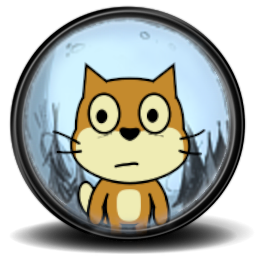

# DontStarve-ScratchEdition
A Scratch project which is made up of a replica of the original game called Don't Starve.

You can download the latest beta version of the [scratch project](https://scratch.mit.edu/projects/418133271/) from here (under the most recent release download the asset with the ending .sb3), then check, or even modifí it opened in [TurboWarp](https://turbowarp.org) [(Desktop)](https://desktop.turbowarp.org/) (it is highly recommended, because the release might not be compatible with Scratch).

If you have any questions, feel free to ask them then.

If we reach version 3.0, I'm planning to package it into an html file or create a normal executable application. (The icon design is already done.)

